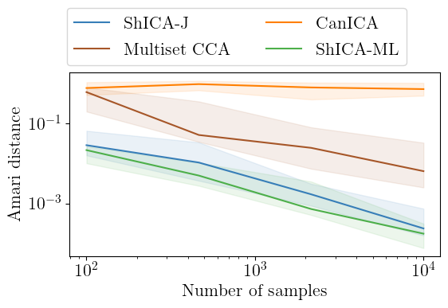
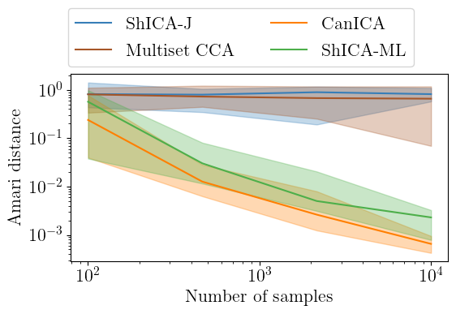
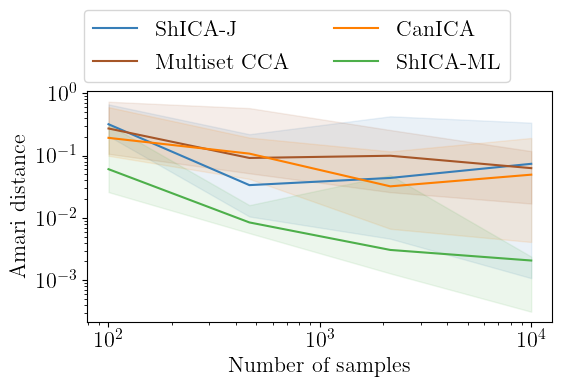

# ShICA

[](https://circleci.com/gh/hugorichard/ShICA)

Code accompanying the paper Shared Independent Component Analysis for Multi-subject Neuroimaging

## Install 
Move into the ShICA directory
``cd ShICA``

Install ShICA
``pip install -e .``

## Reproduce synthetic experiments in Figure 2
Move into the experiments directory
``cd experiments``

Run the bash script to produce results (should take approximately 3 minutes on a modern laptop)
``bash run_all.bash``

Move into the plotting directory
``cd plotting``

Run the bash script to produce figures from the results
``bash plot_all.bash``

Figures are available in the ``figures`` directory.

Performances on Gaussian sources:



Performances on non Gaussian sources:



Performances when some sources are Gaussian and some non-Gaussian:



__Note__
The current implementation uses only 10 seeds and 4 different number of samples in the curves so that computation time is low even on a laptop. In order to obtain exactly the same curves as in the paper you should modify the files `rotation.py`, `full_nongaussian.py` and `semigaussian.py` in the `experiments` directory so that 
```
num_points = 20
seeds = np.arange(40)
ns = np.logspace(2, 5, num_points)
```
